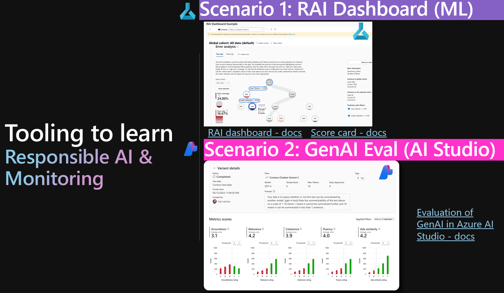

# Azure-RAI-Hax

**Azure Responsible AI hackathon** - AI Studio GenAI evalution metrics and Azure Machine Learning RAI dashboard.

This repo provides data & scenarios with walkthrough, and agenda, to be used at a **hackathon to learn Microsoft Responsible AI tooling.**

# QUICKSTART - I want to hack now!

Get started: Choose scenario 1 or 2. You can do both, in whatever order you like. 

- [Scenario 1 ](./instructions/scenarios/scenario-1-rai-dashboard.md)
- [Scenario 2 ](./instructions/scenarios/scenario-1-rai-dashboard.md)

# GOAL with this hackathon "Azure RAI Hax"
- Learn RAI  tooling
- Networking with fellow peers
- Have fun doing it

# AGENDA "Live agenda"
[AGENDA](./instructions/10-agenda.md)

[Hackathon- more info](./hack-info/readme.md)

# SCENARIOS & DATA

## Scenario 1 - `Responsible AI Dashboard` and `Scorecard` i Azure machine learning for: TABULAR, TEXT, IMAGES
See instructions: [./instructions/scenarios/scenario-1-rai-dashboard.md ](./instructions/scenarios/scenario-1-rai-dashboard.md)

## Scenario 2 - Generative AI evaluation in AI studio with RAG for: Chatbots, GenAI solutions

See instructions: [./instructions/scenarios/scenario-2-genai-evaluation.md ](./instructions/scenarios/scenario-2-genai-evaluation.md)

### DATA
- PRODUCT DATA for "on your data", e.g. RAG to create index on: [./data/scenario-2-genai/3-product-info/ ](./data/scenario-2-genai/3-product-info/)
- CUSTOMER DATA for "on your data", e.g. RAG to create index on: [./data/scenario-2-genai/1-customer-info/](./data/scenario-2-genai/1-customer-info/)
- EVALUATION DATA: [data/scenario-2-genai/6-evaluation-jsonl](./data/scenario-2-genai/6-evaluation-jsonl/)

