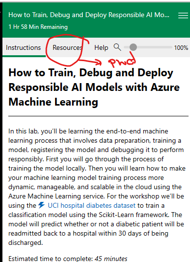
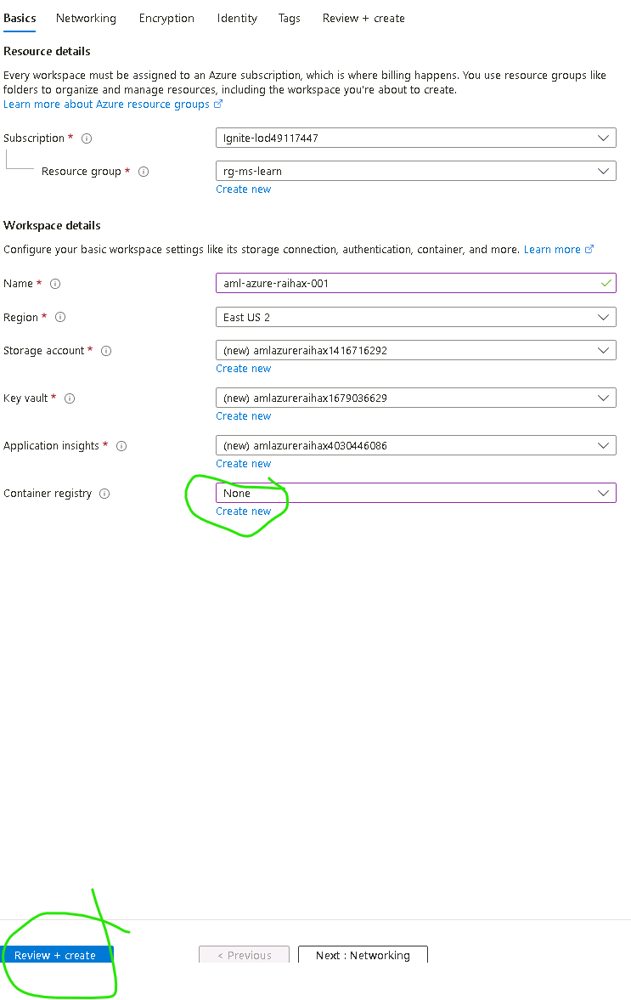
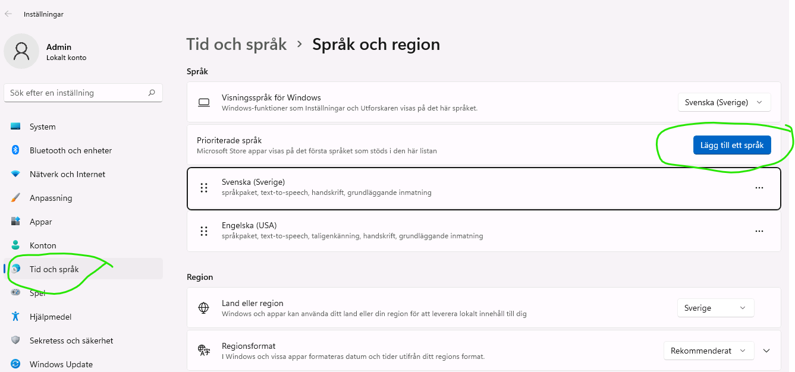
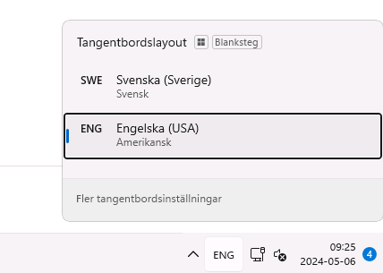

# SCENARIO 1 - Azure ML environment

## Option 1 - SANDBOX: Use provided sandbox Azure environment

https://aka.ms/rai-hub/dashboard-workshop

- Directlink to learning module: https://learn.microsoft.com/en-us/training/modules/train-model-debug-with-responsible-ai-dashboard-azure-machine-learning/?WT.mc_id=aiml-114127-cxa

- Directlink to SANDBOX environment: https://learn.microsoft.com/en-us/training/modules/train-model-debug-with-responsible-ai-dashboard-azure-machine-learning/7-lab-train-debug-model


1) Login with Azure user to Learning module
2) Login with Sandbox user to start Sandbox VM
-  Click thorugh the learning module, until Sandbox environment is optional. 
- Login, with credentials. Cick the T sympbol, and the password will be auto-written.
    - Click Resources (see image), there you have your username and password.
    Credentials is found on the right pane, under "RESOURCES" tab: 



3) Create an Azure Machine Learning workspace, int the resource group "rg-ms-learn"
- Resource group (already created): `rg-ms-learn`
- Example name: **aml-azure-raihax-001**
- Region: US-East
- Container registry: None
4) Verify that it looks similar like below, the click Review+Create, and Create again.



5) Start Azure Machine Learning Studio, and create a Compute Instance
- Example name: ci-azure-rai-hax-001-a
- SKU: **Standard_E4ds_v4**

6) Go to NOTEBOOKS in Azure Machine Learning Studio, and CLONE the REPO: same as: [Option 2 - Bring-your-own-environment](#option-2---bring-your-own-environment)

# TIP - CHANGE KEYBOARD LANGUAGE  - if you don't want English keyboard: 

- Optional: Change language for your keyvoard, to Swedish
    - 1) Click Windows icon, search "Keyvboard language" to be able to add languange. 
    - 2) See image: It should be a button "Add lanugage" on the tab "Time & Languages"

TODO: 



- Signout
- Singin again

You should be able to select language at the TASKBAR now, as below: 




- Open EDGE webbrowser, and signin to Azure portal with sandbox username and password
- Go to RESOURCE GROUP **rg-ms-learn** , and create an Azure Machine Learning workspace

## Option 2 - Bring-your-own-environment

1) Create Azure Machien Learning Workspace
2) Create a Compute Instance (default settings)
3) Go to NOTEBOOKS
4) Open TERMINAL
5) Clone the REPO 
- TIP: If you clone with "SPARSE CHECKOUT" it goes quicker
```python
# Clone the repository into a new directory
git clone --no-checkout --filter=blob:none --branch main https://github.com/Azure/azureml-examples.git
# Navigate into the new directory
cd azureml-examples

# Initialize sparse-checkout
git sparse-checkout init --cone

# Set the directories you want to check out
# Replace <dir> with the directory you want
git sparse-checkout set <dir>

# Pull the files
git pull origin main

```

6) Choose scenario - Recommended scenarios: 
    - TABULAR: 
        - "Housing": Classification
            - https://github.com/Azure/azureml-examples/blob/main/sdk/python/responsible-ai/tabular/responsibleaidashboard-housing-classification-model-debugging/responsibleaidashboard-housing-classification-model-debugging.ipynb
        - "Healthcare - Covid" : Classification
            - https://github.com/Azure/azureml-examples/blob/main/sdk/python/responsible-ai/tabular/responsibleaidashboard-healthcare-covid-classification/responsibleaidashboard-healthcare-covid-classification.ipynb
    - TEXT:"Financial news": Classification
        - https://github.com/Azure/azureml-examples/blob/main/sdk/python/responsible-ai/text/responsibleaidashboard-text-classification-financial-news/responsibleaidashboard-text-classification-financial-news.ipynb

    - IMAGE: "Fridge items": Classification, Object detection
        - https://github.com/Azure/azureml-examples/blob/main/sdk/python/responsible-ai/vision/responsibleaidashboard-image-classification-fridge.ipynb
        - https://github.com/Azure/azureml-examples/blob/main/sdk/python/responsible-ai/vision/responsibleaidashboard-object-detection-MSCOCO.ipynb

7) 
7) Configure a ntoebook with your Azure information
- Azure subscription ID
- Azure Machine Learning workspace ID
- Resource Group

```Python

subscription_id = "<SUBSCRIPTION_ID>"
resource_group = "<RESOURCE_GROUP>"
workspace = "<AML_WORKSPACE_NAME>"

```

8) Run the notebook.
If any errors or trouble - get in contact with the mentors.


# SCENARIO 2 - AI Studio environment

1) Set up your project in Azure AI Studio
- As prerequisite for this lab you need to set up a project in Azure AI Studio(https://ai.azure.com/) and provision the required resources.

Make sure you have created the following resources:
- An Azure OpenAI resource
- An AI search resource
  
You'll need to deploy a chat completions model (e.g. GPT-3.5-turbo 1106) and a text embedding model (e.g. text-embedding-ada-002). Do this in the "deployment" tab in your AI studio project.


