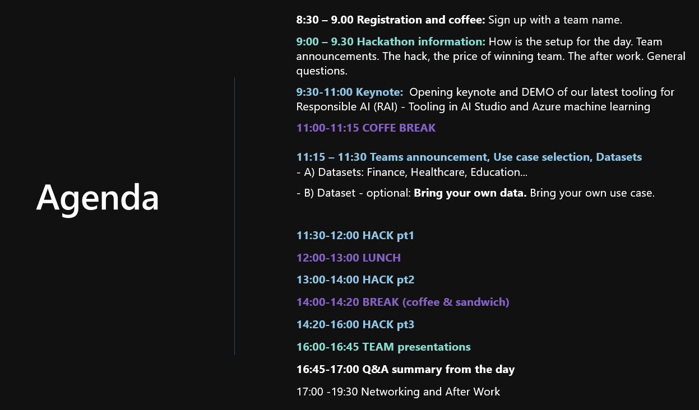

# Invitation text - this hackathon
We will start the day off with an opening keynote and DEMO of our latest tooling for Responsible AI (RAI) with tooling in AI Studio and Azure machine learning. 

Following this, you will be able “bring your own use case” or select one of the DEMO-use cases in purpose to learn the tooling together with our Microsoft mentors. 

Recommended role for this event is data scientist, or machine learning engineer. Tasks (see attached PDF for details) require some basic knowledge about Azure Machine Learning. 

There is a Sandbox Azure environment provided for you. Bring your laptop, and optionally bring your own Azure environment (see PDF for details)
The RAI tooling will empower you with the information needed to help build responsible AI solutions, evaluate chatbot accuracy in real-time or evaluate machine learning model for metrics such as: fairness, transparency, causal analysis, and what-if analysis. 

Bring your laptop & environment for a hack-day of learning and become the leader in your organization for building Responsible AI solutions.

# More information (PDF)

[Hackathon - PDF detailed info](./invitation-pdf/Microsoft_ResponsibleAI_Hackaton_details.pdf)

# Agenda example

# "Live" Agenda

["Live" AGENDA](../instructions/10-agenda.md)

