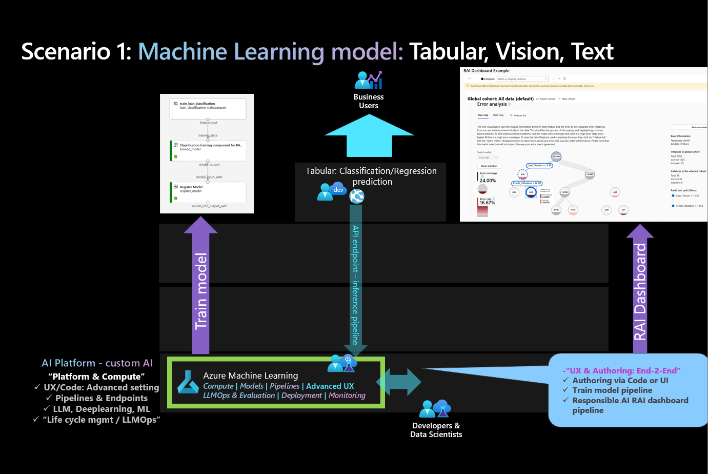
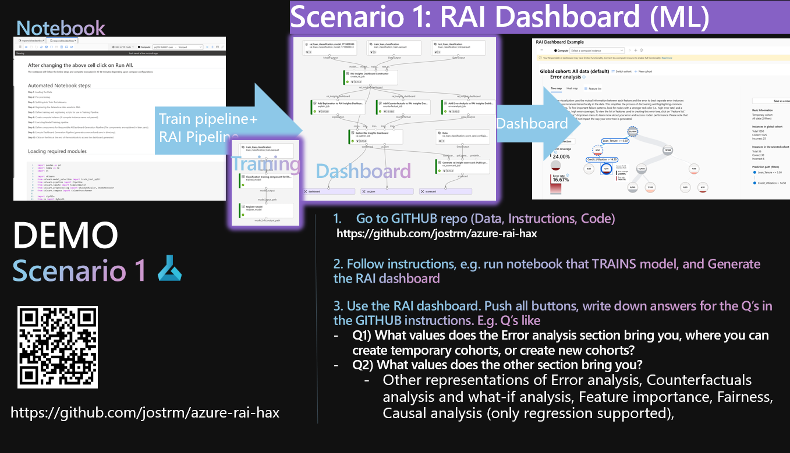
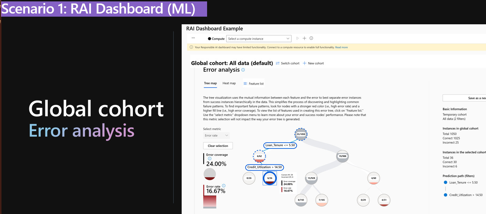
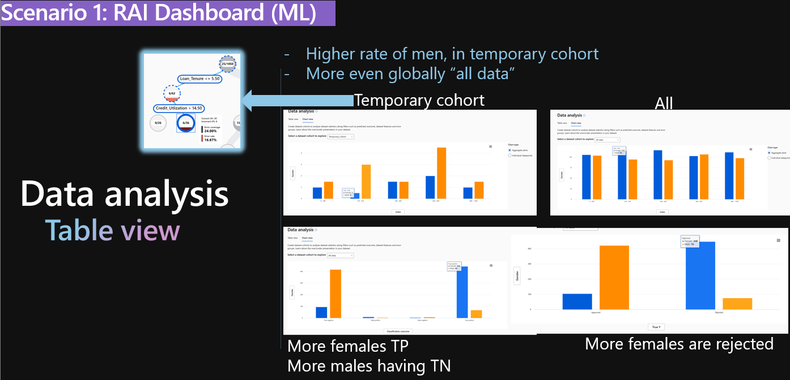

# SCENARIO 1: `Responsible AI Dashboard` and `Scorecard` i Azure machine learning for: TABULAR, TEXT, IMAGES

# ABOUT THIS Lab

In this lab there is 3 TASKS.

### TASK 1 - Run the learning module, to get familiar with Responsible AI
- Here a SAndbox environment will ge provided.

### TASK 2 - Run the lab from GITHUB, to be able to adjust scenarios

You will be able to choose a DEMO scenario, run a notebook that generated 2 artifacts, pipelines: 

- 1st pipeline will TRAIN a model, and register the model.

- 2nd pipeline will GENERATE the RAI Dashboard

You can then use the dashboard to draw different conclusions. 

You can then pick another scenario, or pick your own scenario.

### Solution scenario "conceptiual view"

A conceptual view - to put the lab in context. Below is a possible scenario, where a trained model is consumed by a business user.

The RAI dashboard is included in the MLOps process, to be generated after each retraining of the model. 

### Tooling scenario

# Task 1 - Finnish the learning module (Sandbox evnironment provided)

https://learn.microsoft.com/en-us/training/modules/train-model-debug-with-responsible-ai-dashboard-azure-machine-learning/?WT.mc_id=aiml-114127-cxa

# Task 2 - Try any of these use cases & scenarios from this GITHUB repo

## ENVIRONMENT SETUP - GITHUB
You are to use the **Responsible AI** part of a GITHUB REPO. 
How to setup environment, and how to clone the repo: 
- See [Option 2 - Bring your own environment](../../environment-setup/readme.md)

## CHOOSE SUB-SCENARIO:
Choose from TABULAR, IMAGE, TEXT and any scenarios.
Recommended scenarios: 
    - TABULAR: 
        - "Housing": Classification
            - https://github.com/Azure/azureml-examples/blob/main/sdk/python/responsible-ai/tabular/responsibleaidashboard-housing-classification-model-debugging/responsibleaidashboard-housing-classification-model-debugging.ipynb
        - "Healthcare - Covid" : Classification
            - https://github.com/Azure/azureml-examples/blob/main/sdk/python/responsible-ai/tabular/responsibleaidashboard-healthcare-covid-classification/responsibleaidashboard-healthcare-covid-classification.ipynb
        
    - TEXT:"Financial news": Classification
        - https://github.com/Azure/azureml-examples/blob/main/sdk/python/responsible-ai/text/responsibleaidashboard-text-classification-financial-news/responsibleaidashboard-text-classification-financial-news.ipynb

    - IMAGE: "Fridge items": Classification, Object detection
        - https://github.com/Azure/azureml-examples/blob/main/sdk/python/responsible-ai/vision/responsibleaidashboard-image-classification-fridge.ipynb
        - https://github.com/Azure/azureml-examples/blob/main/sdk/python/responsible-ai/vision/responsibleaidashboard-object-detection-MSCOCO.ipynb

- FYI: DEMO use case the MENTOR rubs: "Loan" : Classification
    - Just FYI. Do not use the below. Since it would be boring to see the same=
    - https://github.com/Azure/azureml-examples/tree/main/sdk/python/responsible-ai/tabular/responsibleaidashboard-finance-loan-classification

## TRAIN MODEL & GENERATE RAI DASHBOARD
Create a Responsible AI Dashboard, by running notebook
 - Example: https://github.com/Azure/azureml-examples/blob/main/sdk/python/responsible-ai/tabular/responsibleaidashboard-finance-loan-classification/responsibleaidashboard-finance-loan-classification.ipynb

## EXPLORE & ANALYZE

Explore the Responsible AI Dashboard, and answer the questions
- Q1) What value does these insights give you?
- Q2) What feature impacts the prediction the most? 
- Q3) Is the dataset skewed, does it has imbalance, and if so what cohort/gender/age group is over/under represented?

Create a new cohort, based on cohort with the most errors:

- Q4) What value does these insights give you?

# EXAMPLE - ANALYSIS of sub-scenario: Loan classification (Tabular/Classification)

## Cohort with most errors

## Analysis of why - comparing if fairness exists across genders

