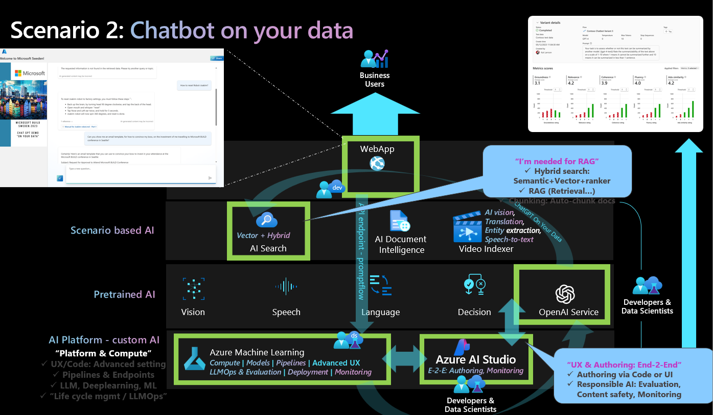
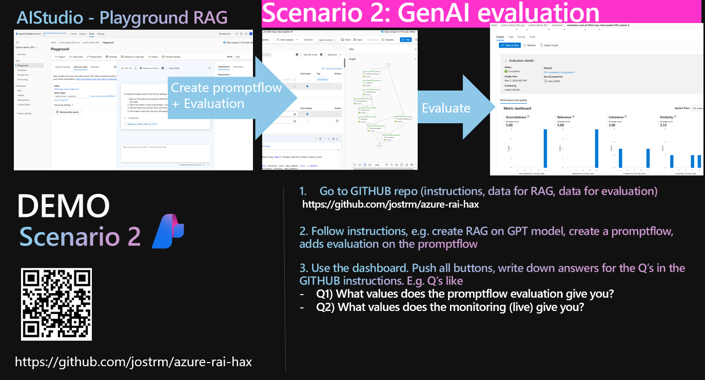
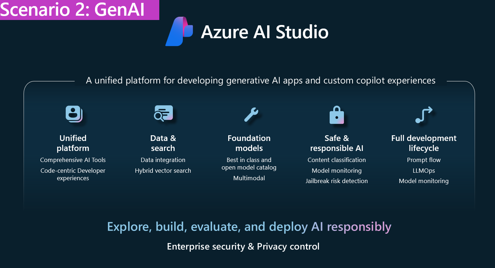

# SCENARIO 2: `Generative AI` evaluation in `AI studio` with RAG for: Chatbots, GenAI solutions

### DATA
- PRODUCT DATA for "on your data", e.g. RAG to create index on: [../../data/scenario-2-genai/3-product-info/ ](../../data/scenario-2-genai/3-product-info/)
- CUSTOMER DATA for "on your data", e.g. RAG to create index on: [../../data/scenario-2-genai/1-customer-info/](../../data/scenario-2-genai/1-customer-info/)
- EVALUATION DATA: [../../data/scenario-2-genai/6-evaluation-jsonl](../../data/scenario-2-genai/6-evaluation-jsonl/)

# About this lab
In this lab we will explore the generative AI evaluation dashboard in Azure AI Studio. You will first build a RAG application based on some sample data. It is a chatbot for **Contoso Outdoor shop** and you can ask questions regarding the product catalog as well as customer purchase histories.

DOCS - Evaluation in AI Studio: https://learn.microsoft.com/en-us/azure/ai-studio/concepts/evaluation-approach-gen-ai

### Solution scenario - "conceptiual view"
A conceptual view - to put the lab in context. Below is a possible scenario, that also includes a Chatbot front end.

### Tooling scenario

### AI Studio: 

### VIDEO - Mehrnoosh Sameki presents the tooling

https://youtu.be/3Fz8FEujD1U?feature=shared&t=1762

# Task 1:Set up your project in Azure AI Studio
As prerequisite for this lab you need to set up a project in Azure AI Studio(https://ai.azure.com/) and provision the required resources.

Make sure you have created the following resources:
- An Azure OpenAI resource
- An AI search resource
  
You'll need to deploy a chat completions model (e.g. GPT-3.5-turbo 1106) and a text embedding model (e.g. text-embedding-ada-002). Do this in the "deployment" tab in your AI studio project.

# Task 2:Build the search indexes using the playground 
1. Go to **Tools-->Playground** in the sidebar. You will use the built-in "**Add your data**" functionality to add your data sources and build an index for it in Azure AI search.
2. Click on "'**+Add a new data source**" button, select "Upload files" where you choose all the documents in the PRODUCT DATA folder. Build an index called e.g. "product-index".
3. After the process finishes, you could test your chatbox in the playground by providing question such as "How much does TrailMaster cost?". The answer should provide a price with a reference to the data that you have grounded the application with in the previous step. You could take a look at some product documents and ask questions accordingly to test that your RAG application is working.
4. Repeat step 2-3 but this time build another index called e.g. "customer-index" using CUSTOMER DATA. An example question to test the RAG works is "What did John Smith buy?", but feel free to explore other questions by looking at Customer data files.

# Task 3:Test manual evaluation feature 
Go to the **Playground tab and make sure you have product-data selected in "Add your data". Then click on **Evaluation** button. Here you can performn manual evaluation of your application. Input some input/expected reponse value and run to see the model reponse in the output. You could also use a jsonl file to import test data (**manual test file** in the folder). A human evaluator could give thumbup/thumdown to check how well the RAG feature works.The result could be exportet for furthur analysis.

# Task 3:Create a prompt flow for product-index only
Go to the **Playground** tab and make sure you have product-data selected in "Add your data". Then click on **Prompt flow** button. It will automatically create a prompt flow object for you. 

**Prompt flow** is a development tool that simplifies the entire development cycle of AI applications powered by Large Language Models (LLMs). It provides a comprehensive solution for prototyping, experimenting, iterating, and deploying AI applications. Prompt flow makes prompt engineering easier and enables building LLM apps with production quality. You can learn more about prompt flow here in this link <https://microsoft.github.io/promptflow/index.html>.

In this lab we will focus on the evaluation feature of prompt flow.

# Task 4:Run RAI evaluation for product-index only flow
At your prompt flow created in the previous step, go to **Evaluation** tab under Tools. Here you could follow the wizard and create your evaluation. Use the test data in EVALUATION DATA folder (Contoso Test Data 3.jsonl) of this repo. Explore groundedness, relevance, coherence, fluency, GPT similarity, F1score and the other content satety matrixs. Spend some time to understand what these metrics mean. 

You could see how your flow works by e.g.using the **chat** functionality (make sure you have your automatic runtime running). Or for debugging purpose it's help to run the box one by one by clicking the "run" icon for each of them sequentially. In this way you get to monitor the output for each step.

Note that some of the questions in the test file actually ask about customer information, which you don't have at this stage in your prompt flow since it is auto generated based solely on the product-index. So it's normal if some of the metrixs are impacted. We will fix it in the following tasks.

# Task 5:Create a prompt flow for multi-indexes
Repeate Task 3 and create another prompt flow based on your product-data index, give it a name e.g. "Multi index flow". We will modify it later on and add the customer index as well.

The step to add the customer index is a great exercise to learn how prompt flow work. You need to clone the step of "RetrieveDocuments" and differentiate them by calling them e.g "RetrieveDocumentsCustomer" and "RetrieveDocumentsProduct". Make sure you have the right index name in the "input" of these steps.

"FormatRetrievedDocuments" is the step you need to do some slight code changes. Some hints/common mitakes:
1. Check that you have both the retrieved customer document and retrieved product document ready from the previous steps in the inputs.
2. Modify the for loop in the code so that it actually loops through both customer and product document.
3. increase your maxTokens variable in the inputs (to e.g. 10000).
4. Feel free to run a notebook on the side to verify your method and check what value the function actually outputs. This in combination of running your boxes one by one (as described in Task4) is useful to help you understand what's going on with your code.

You could test your promptflow by asking either product related or customer related qustions. You could even combine them in the same question like "How much does TrailMaster cost and what was the purchase history of John Smith?". Now the flow is grounded with both customer and product data.

If you run into any issues, please get help the proctors at the event.

# Task 6:Run RAI evaluation for multi-indexes flow
Repeat Task4 to create an evaluation but this time for the newly created multi-indexes flow.

# Task 7:Compare the two evaluation results
Compare the result of the two evaluations from Task4 and Task6 and you should notice an improvement of the evaluation generated from Task6 when it comes to certain matrixs. 

# Furthur exploration
try out how content filtering works by setting up the filters for harm categories such as hate and fairness, sexual, violence, self-harm, and even the new functionalities to detect jailbreak risk and protexted material for text/code.
