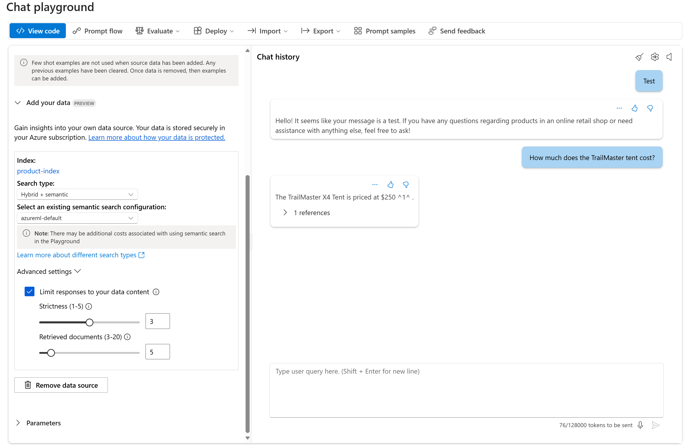
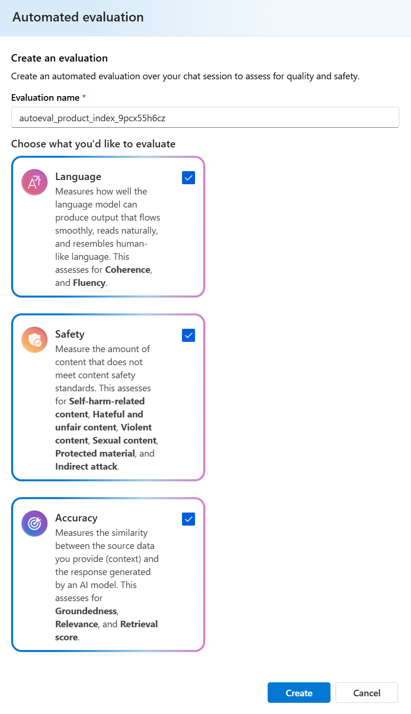
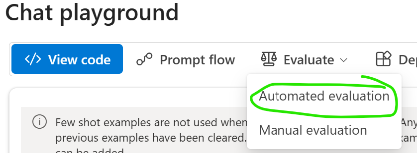
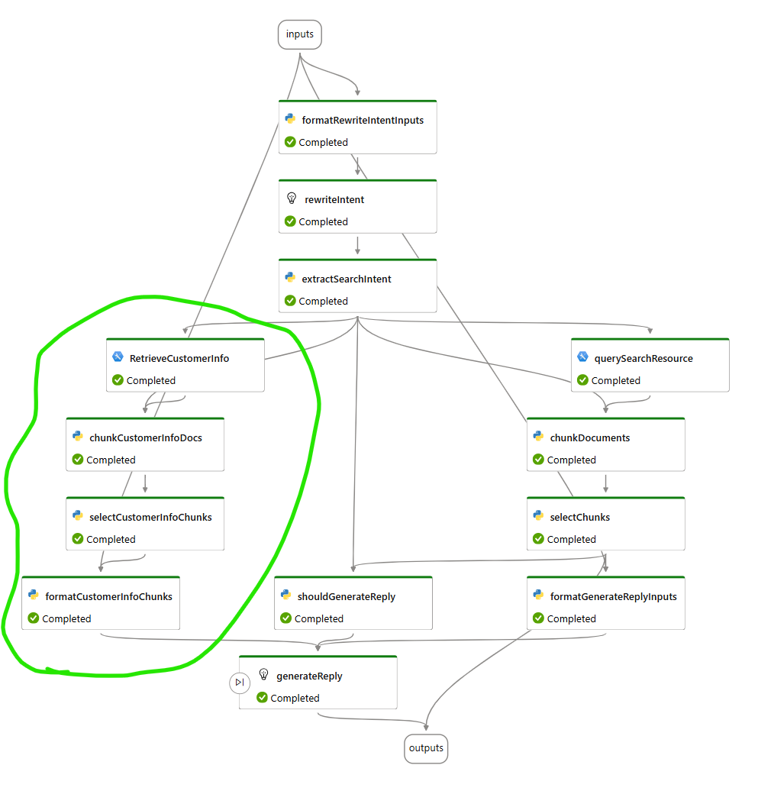

# SCENARIO 2: `Generative AI` evaluation in `AI studio` with RAG for: Chatbots, GenAI solutions

### DATA
- PRODUCT DATA for "on your data", e.g. RAG to create index on: [../../data/scenario-2-genai/3-product-info/ ](../../data/scenario-2-genai/3-product-info/)
- CUSTOMER DATA for "on your data", e.g. RAG to create index on: [../../data/scenario-2-genai/1-customer-info/](../../data/scenario-2-genai/1-customer-info/)
- EVALUATION DATA: [../../data/scenario-2-genai/6-evaluation-jsonl](../../data/scenario-2-genai/6-evaluation-jsonl/)


# About this lab
In this lab we will explore the generative AI evaluation dashboard in Azure AI Studio. You will first build a RAG application based on some sample data. It is a chatbot for **Contoso Outdoor shop** and you can ask questions regarding the product catalog as well as customer purchase histories.

DOCS - Evaluation in AI Studio: https://learn.microsoft.com/en-us/azure/ai-studio/concepts/evaluation-approach-gen-ai

### Solution scenario - "conceptual view"
A conceptual view - to put the lab in context. Below is a possible scenario, that also includes a Chatbot front end.


### Tooling scenario


### AI Studio: 


### VIDEO - Mehrnoosh Sameki presents the tooling

https://youtu.be/3Fz8FEujD1U?feature=shared&t=1762


# Task 1:Set up your project in Azure AI Studio
As prerequisite for this lab you need to set up a project in Azure AI Foundry (formerly named Azure AI Studio) (https://ai.azure.com/) and provision the required resources.

Make sure you have created the following resources:
- An Azure OpenAI resource
- An AI search resource
  
You will need to deploy: 
- Chat completions model (e.g. GPT-3.5-turbo 1106)
- Text embedding model (e.g. text-embedding-ada-002). 

To Deploy the Models this will be under "Models + Endpoints" under the My Assets section or the Deployments. 

# Task 2:Build the search indexes using the playground 
1. Go to **Tools-->Playground** in the sidebar. You will use the built-in "**Add your data**" functionality to add your data sources and build an index for it in Azure AI search.
2. Click on "'**+Add a new data source**" button, select "Upload files" where you choose all the documents in the customer folder called `1-customer-info`. Build an index called e.g. `customer-index`. An example question to test the RAG works is "What did John Smith buy?", but feel free to explore other questions by looking at Customer data files.
3. The indexing process can take some time. After the process finishes, you could test your chatbox in the playground by providing question such as "What did John Smith buy?". The answer should provide several purchases, suich as 2 TrailMaster X4 Tents. You could take a look at the citations, look at product documents and ask questions accordingly to test that your RAG application is working.
4. Repeat step 2-3 but this time build another index called e.g. `product-index` using product data in folder: `3-product-info`. An example question to test the RAG works is "How much does TrailMaster cost?". The answer should provide a price with a reference to the data that you have grounded the application with in the previous step.



# Task 3a:Test manual evaluation feature, in Playground 
Go to the **Playground** tab and make sure you have product-data selected in "Add your data". Then click on **Evaluation** button. Here you can performn manual evaluation of your application. Input some input/expected reponse value and run to see the model reponse in the output. You could also use a `.jsonl` file to import test data from the folder `6-evaluation-jsonl/manual test file.jsonl` which contains some product questions ans answers. A human evaluator could give thumbup/thumdown to check how well the RAG feature works.The result could be exportet for furthur analysis.

# Task 3b:Test auto evaluation feature, in Playground
Simply click on the Automated Evaluation button in the playground, and choose the metrics. After submit, a green message will be shown at the top, where you can click a link to see the status of the submitted evaluation run.




# Task 4:Create a prompt flow for product-index only
Go to the **Playground** tab and make sure you have product-data selected in "Add your data". Then click on **Prompt flow** button. It will automatically create a prompt flow object for you. 

**Prompt flow** is a development tool that simplifies the entire development cycle of AI applications powered by Large Language Models (LLMs). It provides a comprehensive solution for prototyping, experimenting, iterating, and deploying AI applications. Prompt flow makes prompt engineering easier and enables building LLM apps with production quality. You can learn more about prompt flow here in this link <https://microsoft.github.io/promptflow/index.html>.

In this lab we will focus on the evaluation feature of prompt flow.

# Task 5:Run RAI evaluation for product-index only flow
At your prompt flow created in the previous step, go to **Evaluation** tab under Tools. Here you could follow the wizard and create your evaluation. Use the test data in EVALUATION DATA folder (Contoso Test Data 3.jsonl) of this repo. Explore groundedness, relevance, coherence, fluency, GPT similarity, F1score and the other content satety matrixs. Spend some time to understand what these metrics mean. 

You could see how your flow works by e.g.using the **chat** functionality (make sure you have your automatic runtime running). Or for debugging purpose it's help to run the box one by one by clicking the "run" icon for each of them sequentially. In this way you get to monitor the output for each step.

Note that some of the questions in the test file actually ask about customer information, which you don't have at this stage in your prompt flow since it is auto generated based solely on the product-index. So it's normal if some of the metrixs are impacted. We will fix it in the following tasks.

## Why add another index? 
If you ask the below question, which related to `customer info`  rather than `product info`, the LLM connected to only `product info index` will have a hard timet to know the answer. It will not find the answer if you have a `keyword` based index on `product info` only. 
- What purchases did Sarah Lee make, and at what price point?

Hence, multi-index is needed.

# Task 6:Create a prompt flow for multi-indexes
Repeat Task 3 and create another prompt flow based on your product-data index, give it a name e.g. "Multi index flow". We will modify it and have both `product index` the `customer index` as well.

The step to add the `customer index` is a great exercise to learn how prompt flow work. You need to clone (create a new `Index Lookup` via `+More Tooles`) the step of `querySearchResource` and differentiate them by calling them e.g `"RetrieveDocumentsCustomer"` and `"RetrieveDocumentsProduct"` or similar. Make sure you have the right index name in the "input" of these steps.

The last promptflow actity `generateReply` should look like below: 

```markdown
user:
## Retrieved Product Documents 
{{inputs.documentation}}
## Retrieved Customer info Documents 
{{inputs2.documentation}}
## User Question
{{inputs.query}}

```
Note that we have added the below part: 
```markdown
## Retrieved Customer info Documents 
{{inputs2.documentation}}

```

Note that the input variable `input2` can be set to the value `${formatCustomerInfoChunks.output}`

## Q:How to build the activity boxes to end up with an extra input variable? 
You need 3 or 4 activity boxes. You can inspect current flow from `querySearchResource`, `chunkDocuments`  ,`selectChunks`, `formatCustomerInfoChunks` to get an idea.
To try and figure out this, is a good exercise to learn PromptFlow. 

But, if you want to have the answer directly - look at the bottom on this page, where it says `Spoiler alert`. 

### Option A: Create a "clone" of `formatGenerateReplyInputs`
- Tip: Increase your maxTokens variable in the inputs (to e.g. 10000), sinch bringing in more info to context

### Option B: Create a Python activity in the promptflow, with a loop to merge both "selectedChunks"
`formatGenerateReplyInputs` is the step you need to do some slight code changes. Some hints/common mistakes:
1. Check that you have both the retrieved customer document and retrieved product document ready from the previous steps in the inputs.
2. Modify the for loop in the code so that it actually loops through both customer and product document.
3. increase your maxTokens variable in the inputs (to e.g. 10000).
4. Feel free to run a notebook on the side to verify your method and check what value the function actually outputs. This in combination of running your boxes one by one (as described in Task4) is useful to help you understand what's going on with your code.

### Test your multi-index promptflow
You could test your promptflow by asking either product related or customer related qustions. You could even combine them in the same question like 
- Q1) What products did John Smith buy and what other tents exists besides what John Smith bought? 
- Q2) List all tents avaialble to buy?

Now the flow is grounded with both customer and product data.

If you run into any issues, please get help the proctors/mentors at the event.

# Task 7:Run RAI evaluation for multi-indexes flow
Repeat Task4 to create an evaluation but this time for the newly created multi-indexes flow.

# Task 8:Compare the two evaluation results
Compare the result of the two evaluations from Task4 and Task6 and you should notice an improvement of the evaluation generated from Task6 when it comes to certain metrics. 

# Furthur exploration
Try out how content filtering works by setting up the filters for harm categories such as hate and fairness, sexual, violence, self-harm, and even the new functionalities to detect jailbreak risk and protexted material for text/code.

You could also test building your own custom metrics, and see how evaluation/monitor work after deployment.

# GOAL - Winning Team: 
Team with best explanation of how the insights of the RAI metrics can be used, with actions, wins. 

Extra points if all available tools and metrics is analysed, and its meaning explained

# GOALS: Summary of challenges your team can solve: 
- Q1) Single-index evaluation: Save the results, as screshots.
- Q2) What metrics are low, and why is it low? How to improve it? Ellaborate on what actions to take? 
- Q3) How does changes in Temperature, Grounding data, Ground truth data impact the metrics? Try changing one at the time? 
- Q4) Find the performance metrics insights? Examplify Reqeuest VS Time to respond,  for your OpenAI resource?  
- Q5) Auto evaluation: Find the hate_unfairness_evaluator and see how long (ms) this activity was running in your evaluation, and the value of hate_unfairness
- Q6) Multi-index promptflow evaluation: Did the evaluation results differ from Single-index evaluation? In what way

# RESOURCES
## RAI Overview
- [What is Responsible AI?
](https://learn.microsoft.com/en-us/azure/machine-learning/concept-responsible-ai?view=azureml-api-2)

##  
- [Measure and mitigate risks for Generative AI App in Azure AI Studio](https://learn.microsoft.com/en-us/training/modules/measure-mitigate-risks-azure-ai-studio/)
## Generative AI - Evaluation
- [Evaluation of generative AI applications
](https://learn.microsoft.com/en-us/azure/ai-studio/concepts/evaluation-approach-gen-ai)


## SPOILER ALERT: TASK 6) This is how a promptflow can look like




